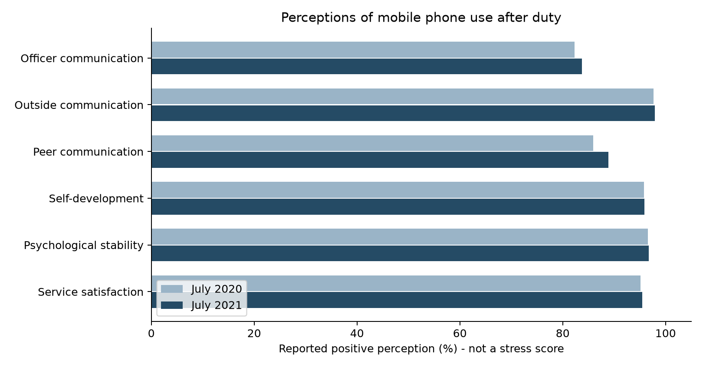

# 병사 휴대전화 사용 허용과 외부 소통 및 심리적 스트레스에 관한 공개자료 연구

작성자 석근욱

작성일 2026년 9월 11일

과제 10 AI와 함께 쓰는 첫 논문

공개 정책 인식 수치와 학술연구 및 시범운용 보고서의 구조화된 검토

---

## 초록

군 조직의 생활환경에서 외부와의 소통 기회가 심리적 스트레스와 어떤 관계를 갖는지 검토하였다. 연구 가설은 군 복무 중 휴대전화 사용 허용으로 외부와의 소통 기회가 증가하면 병사의 심리적 스트레스와 복무염증 수준이 감소한다는 것이다. 직접 조사를 실시하지 않고 정책자료와 공개 학술논문, 시범운용 보고서를 활용하였다. 국방부의 2020년과 2021년 정책 인식 6개 지표를 전수 추출하여 총 12개 집계값과 지표별 퍼센트포인트 차이를 계산하였다. 2018년 시범운용 보고서는 긍정적 의견과 우려를 함께 검토하였고, 스트레스 척도 연구와 스마트폰 과의존 연구는 측정 및 해석의 보조 근거로 구분하였다. 외부 소통 관련 인식은 97.7%와 97.9%, 심리적 안정은 96.6%와 96.7%로 보고되었다. 그러나 두 시점 모두 정책 허용 이후이며 표준화된 스트레스 점수나 복무염증의 전후 변화가 아니다. 과의존과 스트레스의 양의 상관 및 대화 단절에 대한 우려도 확인되었다. 확보한 자료는 소통 편익과 정합적이지만 전체 인과 경로를 직접 검정하지 못하므로 가설은 현재 데이터만으로 판단하기 어렵다. 연구의 기여는 정책 인식과 심리적 결과를 구분하고 검증에 필요한 근거의 공백을 명시한 데 있다.

## 1 서론

### 연구 배경과 질문

이 연구의 관심 분야는 군 조직 환경과 조직 내부 사건, 신고 행동, 심리적 스트레스의 관계이다. 그중 군 외부의 관계를 유지할 수 있는 소통 기회에 초점을 맞추었다. 2020년 7월 1일 병사의 일과 후 휴대전화 사용 전면 시행은 정책자료로 확인된다(문화체육관광부 국민소통실, 2020). 정책의 긍정적 평가가 스트레스의 측정된 감소를 뜻하는지, 그리고 복무염증까지 설명하는지를 구분할 필요가 있다. 특정 군 사건의 원인이나 개인의 동기는 이 연구의 대상이 아니다.

연구 질문은 휴대전화 사용 허용이 외부와의 소통 기회를 늘려 심리적 스트레스와 복무염증을 낮추는가이다. 최종 가설은 다음 한 문장으로 고정하였다. 군 복무 중 휴대전화 사용 허용으로 외부와의 소통 기회가 증가하면 병사의 심리적 스트레스와 복무염증 수준은 감소한다.

### 후보 주제와 선택 과정

초기에는 위계성과 신고 지연, 폐쇄적 생활환경과 부당행위, 상급자 소통과 스트레스, 사회적 지지의 완충효과, 부대 응집성과 정신건강, 수면과 스트레스, 근무 강도와 갈등, 괴롭힘과 스트레스, 조직 신뢰와 신고 의사, 신고 건수와 발생률의 10개 후보를 검토하였다. 측정 방법과 공개자료 확보 가능성, 반대 결과의 의미는 재현 패키지의 가설 과정 기록에 보존하였다.

|검토 후보|최종 주제에서 제외하거나 보조 근거로 둔 이유|
|---|---|
|위계성과 신고 지연|사건 시점과 신고 시점을 위계성 측정치에 연결한 공개자료를 확보하지 못했다.|
|폐쇄성 및 근무 강도와 갈등|집단별 노출과 결과를 같은 기준으로 비교할 자료가 부족했다.|
|부대 응집성과 파병 후 정신건강|초기 공개자료 접근성은 높았지만 이후 사용자가 한국 병사의 휴대전화 가설을 선택했다. 이전 계획은 보존하였다.|
|사회적 지지와 스트레스|휴대전화로 인한 외부 소통의 효과와 동일하지 않아 배경 개념으로 구분하였다.|
|신고 건수와 발생률|신고 접근성 변화가 신고 수를 바꿀 수 있어 접수 건수를 발생률로 해석할 수 없다.|
|휴대전화 허용과 외부 소통|사용자가 최종 선택하였다. 공개 정책자료와 시범운용 보고서가 있고, 직접 효과를 확인하지 못해도 측정 공백을 설명할 수 있다.|

초기 응집성 가설에서 현재 가설로 전환한 과정은 설계 변경 기록에 남겼다. 2026년 9월 10일 분석계획 v2를 작성하기 전에 관련 초록과 일부 결과를 이미 열람하였다. 따라서 본 작업은 결과를 모르는 상태의 사전등록 검증이 아니라 출판된 공개 근거의 구조화된 검토이다. 결과에 맞춰 최종 가설을 다시 쓰지 않았다.

### 선행연구와 이번 연구의 차이

강성록 등(2012)은 군 스트레스 원인과 반응을 구분하는 척도를 개발하였다. 복무염증은 개인신상 영역의 하위요인이고 스트레스 반응 전체와 같지 않다. 김형남과 방혜린(2018)의 시범운용 보고서는 병사와 지휘부의 경험을 기술한다. Hyun 등(2023)은 육군 병사의 스마트폰 과의존과 지각된 스트레스 등의 관계를 조사하였다. 이 자료들은 각각 측정, 경험, 과의존 관련성을 알려주지만 정책 허용의 매개효과를 직접 입증하지는 않는다. 이번 연구에서 새로 수행한 일은 공개 정책 지표의 차이를 재계산하고 서로 다른 근거를 가설의 경로별로 분류한 것이다. 새로운 개인자료나 인과효과 추정치를 생산한 것은 아니다.

## 2 방법

### 설계와 자료 범위

한국 병사를 대상으로 하는 공개자료를 검토하였다. 주요 자료는 국방부(2022)의 성과관리 전략계획, 김형남과 방혜린(2018)의 시범운용 보고서, 강성록 등(2012)의 척도 연구, Hyun 등(2023)의 과의존 연구, 정책 시행일 자료이다. 주검색과 자료 수집은 2026년 9월 10일에 이루어졌으며, 9월 11일 ZIP 재개 후 원본 확인과 제한된 보충검색을 수행하였다. 검색 마감일 연장은 설계 변경 기록에 추가하였다. 모든 관련 논문을 망라한 체계적 문헌고찰이라고 주장하지 않는다.

|자료|분석 단위와 표본|연구에서의 역할|
|---|---|---|
|국방부 2022 전략계획 인쇄 8쪽|2020년 7월과 2021년 7월의 6개 지표, 12개 집계값. 해당 조사 응답자 수 미확인|정책 인식의 기술 분석|
|2018년 시범운용 보고서 전체 11쪽|6개 부대 명칭이 제시된 현장 의견. 전체 면담 인원과 표집 기준 미보고|편익과 우려의 질적 비교|
|강성록 등 2012|척도개발 및 일반병사와 재소자의 비교. 개인자료를 재분석하지 않음|스트레스와 복무염증의 측정 근거|
|Hyun 등 2023 표 1|육군 병사 1,651명, 횡단 설문|과의존과 심리적 지표의 보조 관계|
|2020년 정책 시행 안내|시행일과 정책 범위|시점 확인|

12개 집계값을 12명 또는 12개의 독립 표본으로 계산하지 않았다. 국방부 자료는 KIDA 장병 인식 조사를 재인용한 자료이며 이 연구가 설문 원본을 확보한 것은 아니다. 해당 페이지에 응답자 수, 문항 전문, 가중 방법, 반복 응답 여부가 없어 표준오차나 유의확률은 계산하지 않았다.

### 변수와 반증 조건

독립변수는 휴대전화 사용 허용 여부 또는 정책 적용 단계이다. 매개변수는 외부인과 소통할 기회나 실제 연락 빈도이며, 지각된 소통 편익과 구분한다. 종속변수는 검증된 심리적 스트레스 점수와 복무염증 하위척도 점수이다. 심리적 안정에 대한 긍정 인식은 스트레스 점수가 아니고 군 생활 만족도는 복무염증 점수가 아니다. 과의존 점수도 정책 허용 여부와 동일하지 않다.

가설이 틀렸다면 소통 기회가 증가해도 같은 척도로 측정한 스트레스 또는 복무염증이 유지되거나 증가할 수 있다. 추정 구간이 무변화를 포함하면 감소를 확정할 수 없다. 두 결과와 매개 경로가 함께 뒷받침될 때 전체 가설을 지지한다고 판단하기로 하였다. 자료 미확보 자체는 반증으로 처리하지 않는다.

### 비교와 계산 기준

정책 허용 전후 또는 허용 집단과 미허용 집단을 같은 척도로 비교하는 것이 원래 필요한 조건이다. 실제 확보 자료에서는 그런 직접 비교가 없어 시행 후 두 시점의 인식 차이만 기술하였다. 지표 정의와 단위는 고정하고 2021년 값에서 2020년 값을 뺀 퍼센트포인트 차이를 계산하였다. 서로 다른 지표의 평균·중앙값·최소·최대는 지표 분포의 기술값으로만 제시한다.

결측은 미보고 또는 NA로 유지하였다. 인접한 다른 조사의 표본 수를 가져오거나 비율로부터 응답자 수를 역산하지 않았다. 출처와 본문이 확인되지 않은 자료는 정량 통합에서 제외하였다. 정책 인식, 과의존 상관, 현장 의견은 단위가 달라 메타분석이나 하나의 효과크기로 합치지 않았다. 채택한 지표 6개는 전부 포함하고, 현장 보고서의 불편·우려도 함께 기록하였다.

### 재현 방법

04_analysis/analysis.py는 03_data/raw/mnd_evaluation.pdf의 PDF 11쪽에서 지표 6개의 두 연도 값을 추출하여 정리 자료, 기술통계, 표와 그림 1을 생성한다. 필요한 프로그램은 Python이며 pdfplumber와 matplotlib을 사용한다. 압축을 푼 후 패키지 루트에서 python -m pip install -r 04_analysis/requirements.txt를 실행하고 python 04_analysis/analysis.py를 실행한다. 원자료 해시와 산출값 대조 절차는 README에 기록하였다. 이 재현은 공개 집계값의 재계산이며 원연구의 개인자료 회귀를 재실행하는 것은 아니다.

## 3 결과

### 정책 인식의 기술 분석

표 1은 국방부(2022)의 인쇄 8쪽에 있는 관련 지표 전체이다. 외부와 소통은 두 시점 모두 가장 높은 비율이며 간부와 소통은 가장 낮다. 모든 지표의 차이는 양수이고 0.1~3.0%p 범위이다. 응답자 수와 조사 설계가 없으므로 이 차이를 통계적으로 유의한 증가라고 부르지 않는다.

표 1 휴대전화 사용 관련 정책 인식

|지표|2020년 %|2021년 %|차이 %p|
|---|---:|---:|---:|
|간부와 소통|82.3|83.7|+1.4|
|외부와 소통|97.7|97.9|+0.2|
|병사 간 소통|85.9|88.9|+3.0|
|자기개발|95.8|95.9|+0.1|
|심리적 안정|96.6|96.7|+0.1|
|군 생활 만족도|95.1|95.5|+0.4|

출처 국방부(2022), PDF 11쪽 인쇄 8쪽. KIDA의 각 연도 7월 인식 조사 재인용. 긍정 인식 관련 비율이며 문항 전문과 응답자 수는 해당 페이지에 없다.

그림 1은 표 1의 비율을 0에서 시작하는 공통 축으로 표시하였다. 스트레스 점수의 감소나 정책 시행 전후 비교를 나타내지 않는다.

표 2 지표 분포의 기술통계

|시점|지표 수|평균 %|중앙값 %|최소 %|최대 %|
|---|---:|---:|---:|---:|---:|
|2020년|6|92.233|95.45|82.3|97.7|
|2021년|6|93.100|95.70|83.7|97.9|

서로 다른 지표의 동일가중 평균으로, 병사 평균이나 통합 정책효과가 아니다. 6개 중 6개 지표의 차이가 양수라는 빈도는 지표 수준의 기술값이다.

### 가설과 방향이 일치하는 간접 결과

표 1의 외부 소통과 심리적 안정에 대한 높은 인식 비율은 가설이 예상하는 편익과 방향이 맞는다. 2018년 보고서에서는 외부 연락이 쉬워지고 고립감이 줄었다는 의견, 개인 시간과 여가 선택이 늘었다는 의견, 스트레스 해소에 도움이 된다는 의견이 제시된다(김형남·방혜린, 2018, 인쇄 1·4·8~9쪽). 이는 현장 의견에 대한 보고이며, 표준화된 스트레스 변화량을 측정한 결과는 아니다.

### 가설을 단순하게 적용하기 어려운 결과

2018년 보고서는 대화 단절에 따른 신병 적응 우려, 기기와 요금 차이에 따른 부담, 사용시간·통제 방식의 불편도 기록하였다. 지휘부가 활동 감소를 우려한 데 비해 병사는 다른 방식의 소통·여가가 생겼다고 평가한 사례도 있다(인쇄 5~6·9~10쪽). 보고서 안의 서로 다른 관점을 삭제하지 않았다. 면담자 발언에 등장하는 수치를 전수 발생률로 재계산하지 않았다.

표 3 스마트폰 과의존과 심리적 지표의 보조 상관

|과의존과 함께 측정한 변수|상관계수 r|원문 유의수준|해석 범위|
|---|---:|---|---|
|지각된 스트레스|0.363|p<.001|과의존이 높은 사람의 스트레스도 높은 경향|
|심리적 고통 GSI|0.388|p<.001|과의존과 고통의 양의 관련성|
|주관적 안녕 SWB|-0.277|p<.001|과의존과 안녕의 음의 관련성|

출처 Hyun 등(2023), 표 1, 인쇄 1190쪽. 같은 1,651명의 횡단자료에서 나온 세 상관이며 독립 표본 세 개가 아니다. 상관의 방향은 사용의 과도함과 소통의 편익을 구분할 필요를 보여주지만, 휴대전화 허용 가설의 직접 반증으로 단정할 수 없다.

### 직접 근거의 공백

|가설의 경로|확인한 자료|확인하지 못한 사항|
|---|---|---|
|허용에서 외부 소통으로|외부 소통 97.7%와 97.9%, 현장 의견|같은 사람의 실제 연락 빈도 전후 변화|
|외부 소통에서 스트레스 감소로|심리적 안정 인식과 해소 의견|동일 스트레스 척도의 전후 비교 및 매개효과|
|외부 소통에서 복무염증 감소로|복무염증을 구분하는 척도개발 근거|휴대전화 관련 복무염증 변화량|
|정책의 전체 인과효과|시행 후 인식 자료와 관찰연구|미허용 비교집단과 교란 통제를 갖춘 직접 검정|

검토한 공개자료에서 마지막 열을 채울 확인 가능한 근거를 찾지 못했다. 이 진술은 모든 관련 자료가 존재하지 않는다는 뜻이 아니다.

## 4 논의

### 가설 판단과 선행연구 비교

최종 판단은 현재 데이터만으로 판단하기 어려움이다. 외부 소통 97.7~97.9%와 심리적 안정 96.6~96.7%는 간접적으로 정합적이지만, 스트레스와 복무염증 점수의 감소 또는 소통의 매개효과를 제시하지 않는다. 따라서 긍정 인식만으로 전체 가설을 지지한다고 결론 내리지 않았다. 자료 부족을 이유로 가설을 기각하지도 않았다.

강성록 등(2012)의 척도 연구는 스트레스 원인과 반응, 복무염증을 구분하도록 해 준다. 해당 논문의 일반병사와 재소자 비교는 정책 전후 비교로 사용할 수 없다. Hyun 등(2023)의 과의존 상관은 사용이 많거나 문제가 있는 경우의 심리적 상태를 다루므로, 휴대전화 허용의 편익과 함께 존재할 수 있다. 건강한 소통 기회와 과의존은 같은 독립변수가 아니다. 이번 분석은 이 개념 구분을 유지하면서 공개 정책 수치를 재계산했다.

### 예상과 다른 의견의 가능한 설명

외부 소통이 편해져도 군 내부의 대면 교류가 줄거나 사용 비용이 부담될 가능성이 있다. 지휘부와 병사가 활동을 평가하는 기준도 다를 수 있다. 그러나 이러한 가능성은 보고서 의견과 자료 구조에서 도출한 해석이며, 실제 매개 경로나 집단 차이의 원인으로 검정되지 않았다. 과의존과 스트레스의 상관에는 스트레스 때문에 사용이 늘어나는 역방향, 자기통제나 기존 정신건강 같은 교란이 있을 수 있다. 횡단자료만으로 방향을 확정할 수 없다.

2020년과 2021년은 모두 정책 시행 후이며 조사 구성이 동일한지 확인되지 않았다. 코로나19 상황, 다른 복무여건 변화, 표본 차이 등이 두 시점의 인식에 관련됐을 가능성이 있으나 이 자료에서 기여도를 분리할 수 없다. 0.1~3.0%p 차이는 이 조건을 전제로 한 기술값이다.

### 이 연구로 말할 수 없는 것

휴대전화 허용이 스트레스를 특정 비율만큼 줄였다고 말할 수 없다. 복무염증이 감소했거나 소통이 그 원인이라고 확정할 수도 없다. 정책 만족도와 심리적 안정 인식은 검증된 증상 점수를 대체하지 못한다. 공개 집계자료의 분모와 문항, 표집 정보가 없어서 추정의 정밀도나 대표성을 확인하지 못했다. 현장 보고서는 긍정·부정 의견을 보여주지만 전국 병사의 경험 빈도를 제공하지 않는다. 특정 군 사건의 원인이나 신고되지 않은 부당행위를 추론하지 않으며, 과의존 관련성을 이유로 병사나 피해자를 비난하지 않는다.

또한 문헌 탐색 범위가 제한돼 누락 가능성이 있고, 원보고서의 재인용 및 긍정적 정책 평가에 대한 선택 편향을 배제할 수 없다. Hyun 등(2023)의 지각된 스트레스 응답 코딩 설명과 표 범위에는 불일치가 있어 원점수 재산출을 하지 않았다. 서로 다른 자료의 측정 단위와 표본을 통합하지 않았다.

### 향후 공개자료 분석

같은 스트레스·복무염증 척도와 실제 소통 빈도를 정책 전후에 측정한 비식별 공개자료가 필요하다. 가능하다면 비교집단, 군종·복무기간·기존 정신건강 및 다른 정책 변화를 함께 통제해야 한다. 현재 가설은 수정하지 않고 이러한 추가 검증의 대상으로 남긴다. 새로운 직접 설문을 실시하거나 실제 피해자에게 경험을 질문하는 연구를 이 과제에서 수행하지 않는다.

## 5 결론

공개 정책자료에서 휴대전화 사용의 외부 소통과 심리적 안정에 관한 긍정 인식을 확인했고, 현장 보고서에서는 고립감 완화와 여가 확대에 대한 의견을 확인했다. 동시에 대화 단절과 비용 부담에 대한 우려, 과의존과 스트레스의 양의 관련성도 확인하였다. 이 결과들은 휴대전화 사용의 양상과 환경을 구분해야 함을 보여준다. 그러나 확보한 자료는 외부 소통 증가가 심리적 스트레스와 복무염증을 낮춘다는 전체 인과 경로를 직접 검정하지 못하므로 가설의 지지 여부는 현재 데이터만으로 판단하기 어렵다. 이 연구의 결론은 근거가 허용하는 편익의 범위와 측정 공백을 함께 제시하는 데 한정된다.

## 참고문헌

강성록, 고재원, 김용주. (2012). 군내 스트레스 분석을 통한 스트레스 진단 척도 개발 연구. 한국심리학회지: 일반, 31(2), 345–367.

국방부. (2022, 8월). 성과관리 전략계획 2022~2026. 국방부.

김형남, 방혜린. (2018, 11월 21일). 병사 스마트폰 사용 시범 운용 실태 조사 보고서. 군인권센터. 표지의 작성자 표기를 따랐으며 조사자는 박찬구, 이영하, 임태훈으로 별도 기재되어 있다.

문화체육관광부 국민소통실. (2020, 7월 1일). 정책달력 7월부터 달라집니다. 대한민국 정책브리핑.

Hyun, S., Ku, X., Kang, S., Choi, Y., Ko, J., & Lee, H. (2023). Could military commanders’ good leadership influence subordinates’ smartphone overdependence? A serial mediation analysis. International Journal of Mental Health Promotion, 25(11), 1187–1195. DOI 10.32604/ijmhp.2023.030745.

참고문헌의 원본 파일, 수집일과 출처 URL은 재현 패키지 02_references/source_manifest.json에 기록하였다.
